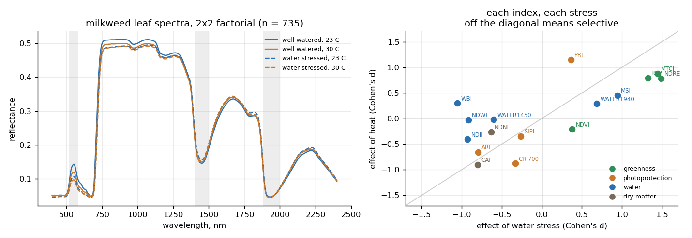
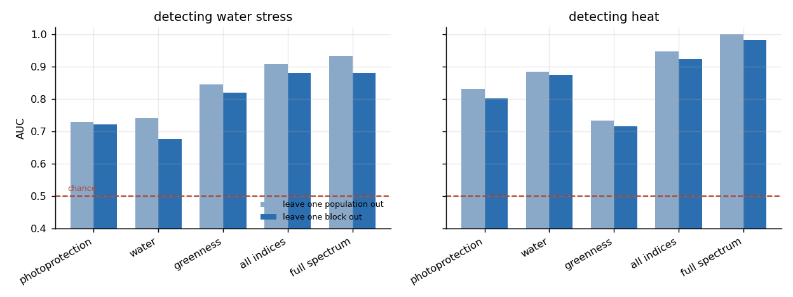
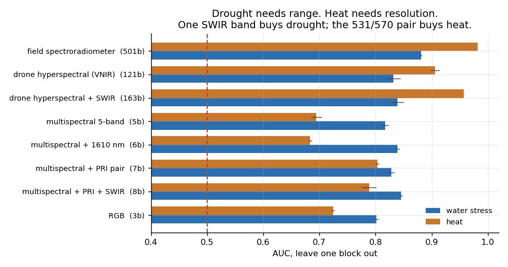
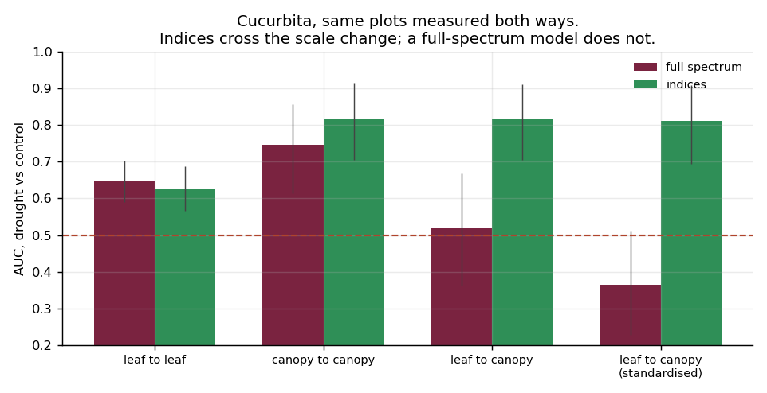
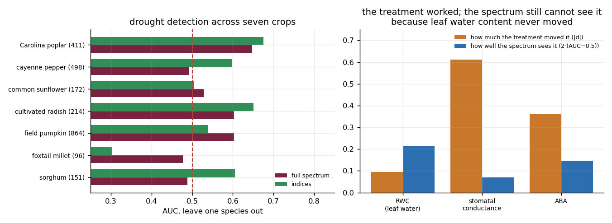
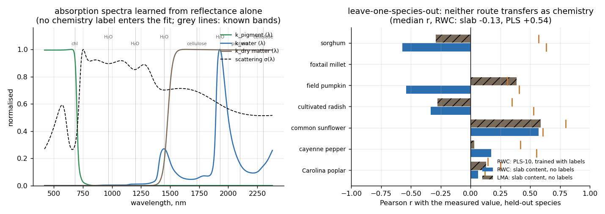

# Which crop stress a spectrum can actually see

A framework for training and validating hyperspectral stress detectors,
built around the two steps that decide whether one works in the field: telling
heat from drought, and getting from a hand-held spectrometer to a camera on a
drone.

Almost every hyperspectral crop-stress paper reports the same thing: an
accuracy, on one experiment, under a random split. That number tells you
nothing about the three questions a deployment actually turns on.

1. **Which stress is it?** "Stress detected" is not actionable. Irrigating a
   heat-stressed crop and shading a thirsty one are both wrong.
2. **Will it survive the instrument?** The calibration is built with a contact
   probe over 400 to 2400 nm. The drone carries a silicon camera that stops at
   1000 nm, or five broad filters.
3. **Is the label real?** "Droughted" describes the watering can. It does not
   promise the plant is short of water — and this repository contains a
   dataset where it wasn't.

Four experiments on three published datasets, each answering one of those.
A fifth replaces the regression with a physical model of the leaf, to see
whether the chemistry it returns survives a new crop.

---

## Three experiments from EcoSIS

All three are open leaf- and canopy-level spectra with treatment labels and
measured plant traits, from [EcoSIS](https://ecosis.org). Reflectance was
resampled once to 4 nm over 400 to 2400 nm.

| dataset | n | design | what it answers |
|---|---|---|---|
| Common milkweed under water stress and elevated temperature (J. Couture, 2015) | 735 | 2×2 factorial: well-watered / water-stressed × 23 °C / 30 °C, 5 populations, 4 growth rooms, 2 blocks | can the two stresses be told apart |
| Cucurbita pepo under two stresses, leaf **and** canopy (A. C. Burnett, S. P. Serbin, A. Rogers, 2020) | 627 | drought / control / sink manipulation, 19 field plots, both measurement scales on the same plots | the hand-held-to-drone step |
| Droughted and watered crops (A. C. Burnett, S. P. Serbin, K. J. Davidson, K. S. Ely, A. Rogers, 2020) | 2 406 | 7 species, droughted / watered, days 0 to 28, with leaf water content, stomatal conductance, ABA and proline | transfer across crops, and whether the label is real |

**Quality control first.** All three contain spectra that a leaf cannot
produce: reflectance above 1, up to 6.1 in the canopy measurements, and
detector-splice steps. 112 of 715 Cucurbita and 56 of 2 462 crop spectra fail
a four-part physical check and are dropped before anything is fitted. Left in,
they dominate any model that uses absolute amplitude.

---

## Can a spectrum tell heat from drought?



The milkweed experiment crosses watering with temperature, so each effect can
be estimated inside the levels of the other. The right panel puts every index
on those two axes. Anything off the diagonal is selective.

The mechanistic prediction holds cleanly:

| index | reports | d, water | d, heat |
|---|---|---|---|
| WBI | water | −1.05 | +0.30 |
| NDWI | water | −0.92 | −0.02 (p = 0.73) |
| WATER1450 | water | −0.60 | −0.02 (p = 0.75) |
| PRI | photoprotection | +0.36 | **+1.15** |
| CRI700 | pigments | −0.33 | −0.88 |
| NDRE, MTCI, REP | greenness | +1.3 to +1.5 | +0.8 to +0.9 |

Water-band depth moves with water and, to within the resolution of 735
samples, not with temperature. PRI — the xanthophyll-cycle index at 531 nm
against 570 nm — moves three times more with temperature than with water.
Greenness indices move with both. That is why "stress detected" is all a
greenness-based system can say.



**And here the tidy story breaks.** Building a classifier from just the water
group does not make it a water detector. It predicts heat at AUC 0.88 and
water at 0.68. The photoprotection group behaves the same way. Heat is simply
the easier target in this experiment, whatever you feed the model. A
selective marker is not automatically a sufficient feature set, which is worth
knowing before designing a camera around one index.

**The split matters more than the features.** Temperature was applied per
growth room, and rooms are nested inside temperature, so a model can score on
the room instead of the plant. Splitting by source population leaves that
confound intact and gives AUC 0.999 for heat. Splitting by block puts the test
on a *different pair of rooms* at the same two temperatures and gives 0.982.
The signal survives, which is the evidence that it is heat and not furniture.
Water stress, applied inside every room, carries no such confound: 0.933 →
0.879 across the two splits.

Four-class accuracy (watering × temperature), split by block: **0.653** against
0.25 for chance. The water axis is right 73% of the time and the temperature
axis 91%.

---

## What survives the instrument?



The same two questions asked of eight instruments, everything else held fixed.
Each instrument is modelled by its band centres, band widths and noise. A flat
spectrum passes through all of them unchanged, which is what makes the
comparison about the instrument rather than about the weighting.

| instrument | bands | water stress | heat |
|---|---|---|---|
| field spectroradiometer, 400 to 2400 nm | 501 | 0.881 | 0.982 |
| drone hyperspectral, VNIR only | 121 | 0.831 | 0.906 |
| drone hyperspectral + SWIR | 163 | 0.839 | 0.958 |
| multispectral, 5 bands | 5 | 0.817 | 0.694 |
| multispectral + 1610 nm | 6 | **0.839** | 0.684 |
| multispectral + 531/570 pair | 7 | 0.828 | **0.803** |
| multispectral + both | 8 | 0.845 | 0.789 |
| RGB | 3 | 0.802 | 0.725 |

Two things here were not what I expected.

**Drought is the robust one.** Cutting the range at 1000 nm loses both
strong water absorptions, yet it costs drought detection only 0.05 AUC. Water
content also changes the broad shape of the near-infrared plateau, and five
broad bands capture that. Heat loses more (0.076), and a five-band camera
loses 0.29.

**Heat is fragile because PRI needs narrow bands.** The photochemical
reflectance index compares 531 nm with 570 nm, 39 nm apart. A multispectral
camera's green band is 27 nm wide and centred at 560 nm, so it cannot form PRI
at all. Adding two 10 nm bands at 531 and 570 recovers 0.11 AUC of heat
detection and does nothing for drought. Adding one 1610 nm band recovers 0.02
of drought and does nothing for heat.

That is the cleanest result in this repository, because it is an intervention
rather than a correlation. Each hardware addition buys back exactly the stress
its mechanism predicts, and only that one.

**The design rule.** If the mission is irrigation scheduling, five bands plus
one shortwave band is enough and a hyperspectral head is not worth its weight.
If the mission is heat or light stress, no multispectral camera will do it.
You need either narrow bands placed on the xanthophyll feature or a
hyperspectral sensor.

---

## Does a leaf calibration survive a camera above the row?



A contact probe fills its field of view with one flat leaf under its own lamp.
A camera above the row sees that leaf at whatever angle it grew, plus the
leaves beneath it, plus shadow, plus soil. The Cucurbita experiment measured
both on the same plots on the same days, so the step can be measured.

Drought against control, split by plot, 95% bootstrap intervals:

| | full spectrum | indices |
|---|---|---|
| leaf → leaf | 0.648 [0.59, 0.70] | 0.627 [0.57, 0.69] |
| canopy → canopy | 0.747 [0.61, 0.86] | 0.817 [0.70, 0.92] |
| **leaf → canopy** | **0.521 [0.36, 0.67]** | **0.817 [0.71, 0.91]** |
| leaf → canopy, standardised | 0.365 [0.23, 0.51] | 0.811 [0.70, 0.91] |

Three things follow.

**The canopy carries more drought signal than the leaf**, not less. Drought
changes leaf angle, wilting and exposed soil. All of that is in a canopy
view and none of it is in a contact measurement. The field leaf-level number
(0.65) is also far below the growth-chamber number for milkweed (0.88), which
is the usual gap between a controlled experiment and a field.

**A full-spectrum model does not survive the scale change.** It lands at
chance, while an index model transfers at the same accuracy it achieves when
trained on canopy data directly. The indices were defined by mechanism before
any fitting. The full-spectrum model fitted whatever separated the leaf
classes, including things that exist only in a contact measurement.

**The obvious fix makes it worse.** Standardising each measurement mode to its
own mean and variance is the cheapest domain adaptation there is. It drops the
full-spectrum transfer from 0.52 to 0.37, reliably backwards. Scaling does not
align two distributions that differ in shape, and a mis-specified correction
is worse than none.

The confuser stays hard. Separating drought from a sink manipulation (fruit
removal — stressed but not thirsty) and control reaches 0.52 at leaf scale and
0.50 at canopy, against 0.33 for chance.

---

## Was the drought label real?



Leave-one-species-out drought detection across pumpkin, pepper, poplar,
radish, sunflower, sorghum and millet: **AUC 0.567** pooled, 0.48 to 0.68 per
species, and no better within a species than across them. Detection does not
improve with time into the treatment either: 0.55 on day 0, 0.61 at days
8 to 14, 0.55 at days 15 to 21.

A team with only the label and the spectra would conclude the model needs more
data, or a deeper architecture. The physiology says otherwise:

| what the treatment did | droughted | watered | Cohen's d |
|---|---|---|---|
| leaf relative water content | 79.1% | 79.9% | **−0.09** |
| stomatal conductance | 0.188 | 0.294 | −0.61 |
| abscisic acid | 1614 | 339 | +0.36 |
| proline | 2.72 | 1.87 | +0.25 |

The plants were genuinely droughted. They shut their stomata, flooded
themselves with ABA and accumulated proline. And they **held their leaf water
content constant**, which is textbook isohydric regulation, trading gas
exchange to protect hydration.

Reflectance in this range measures water content and pigments. The one thing
the treatment did not change is the one thing the instrument measures. Asked
to predict the physiological states directly, from median splits taken within
species so the crop cannot be guessed, the spectrum manages AUC 0.56 for water
content, 0.58 for stomatal conductance and 0.57 for ABA. Simply knowing the
treatment label predicts conductance at 0.71. The spectrum adds nothing.

One detail rescues the method's honour. The index model's score correlates
with measured water content at r = +0.25, while the treatment label correlates
with it at −0.05. The spectral model is reading the plant. The label is not.

**The rule this gives the framework:** before training on a treatment label,
check what the treatment did to the quantity your instrument measures. If the
label moved and that quantity did not, no model will close the gap. The right
deliverable is then a specification change — a thermal camera for stomatal
closure, or fluorescence for photosystem state — not a bigger network.

---

## Does a physical model of the leaf transfer where regression did not?



Everything above reads the spectrum with indices or a regression. Neither is a
model of the leaf. The last experiment asks what changes when the leaf is
modelled, and whether the chemistry that comes out survives the same
leave-one-species-out test that broke the regression.

A leaf is a scattering, absorbing layer of finite thickness. Its reflectance
follows the Kubelka–Munk solution for a slab over a dark backing,

    R(λ) = 1 / (a + b·coth(b·S·d)),   a = 1 + K/S,   b = √(a² − 1),
    K·d = Σᵢ Cᵢ kᵢ(λ),                 S·d = s·σ(λ),

with three absorbing constituents at contents Cᵢ per unit area, a scattering
thickness s per leaf, and specific absorption spectra kᵢ(λ) and a scattering
spectrum σ(λ) that are small networks of wavelength. All of it is learned
jointly from the 2 344 crop leaf spectra alone; **no measured water content or
mass per area enters the fit at any point.** The physics-informed part is
strict. The network can only produce reflectance through that equation, so the
per-leaf numbers it returns are contents and a thickness, not features.

Two things had to be fixed before the decomposition meant anything, and both
are recorded because they are the usual failure modes of this kind of model.
The optically-thick form of Kubelka–Munk (the one behind the familiar
(1−R)²/2R transform) is blind to thickness by construction, so it cannot
separate "more water" from "more leaf". The finite-slab form can. And with
three unconstrained constituents, two of them learned the water bands and none
learned dry matter. The decomposition is not identifiable from reflectance
alone. Each constituent was therefore given a **support window** — pigments
below 780 nm, water above 880 nm, dry matter above 1 480 nm — and only the
shapes inside the windows are learned.

**What the fit produces.** The slab reproduces the spectra (root-mean-square
residual about 0.015 in reflectance), and the learned spectra land where the
chemistry says they should. The water constituent peaks at 1 448 and 1 928 nm
with shoulders at 970 and 1 200 nm, the pigment constituent fills the visible
and switches off at the red edge, and the dry-matter constituent occupies the
short-wave infrared beyond 1 500 nm. Reflectance alone, with no label,
recovers the absorption bands of water. That part works.

**What it does not produce is chemistry that transfers.** Within a species the
water content does correlate with measured relative water content, but the
sign changes from crop to crop: +0.56 in radish, +0.39 in sorghum, −0.14 in
pumpkin. Leaving each species out in turn, fitting the endmembers on the other
six and reading the held-out leaves' water fraction against their measured
RWC gives r = +0.57 on sunflower, −0.54 on pumpkin, −0.57 on sorghum, and a
median of **−0.13** over the seven. Dry matter against leaf mass per area:
median **+0.08**.

The regression baseline does not do better where it counts. A ten-component
PLS trained with the labels of six species reaches a median correlation of
+0.54 with RWC on the seventh, but its median R² is **−0.33**. It ranks the
leaves of a new crop better than chance and predicts their values worse than
the mean. For LMA the picture is the same (r +0.38, R² −1.70).

The physical reading of the negative is the one the label section already
gave. Relative water content in this experiment varies by 2 to 5 points within
a species, because the crops were isohydric, and a 2 % change in the water
band is inside what the leaf's own thickness, surface and internal structure
do to the same band. The slab model separates water from thickness in
principle. On leaves whose water barely moved it separates them into
species-specific scatter. A model can be physically right and still have
nothing to read.

**What this adds to the framework:** a decomposition that returns *named*
quantities with the units of a leaf, so that when it fails the failure can be
read. Here it says that the water signal a new species presents is dominated
by its structure, not its hydration. That is the diagnosis a regression cannot
give.

---

## Bottom line

| # | Finding | Evidence |
|---|---------|----------|
| 1 | Heat and drought move **different** parts of the spectrum. NDWI and the 1450 nm water band respond to water with no detectable temperature effect (d = −0.02, p = 0.73). PRI responds to temperature three times more strongly than to water (d = 1.15 vs 0.36). | heat vs drought |
| 2 | But mechanism does not equal prediction. A classifier built only on water indices predicts *heat* better (AUC 0.88) than it predicts water (0.68). Selectivity of a marker and sufficiency for a decision are different properties. | heat vs drought |
| 3 | **Drought needs range; heat needs resolution.** Cutting to a silicon drone camera costs heat 0.08 AUC and drought 0.05. A five-band multispectral camera costs heat 0.29. Adding one 1610 nm band buys back drought (+0.02) and nothing else; adding the narrow 531/570 pair buys back heat (+0.11) and nothing else. | instrument |
| 4 | Going from a leaf probe to a canopy view destroys a full-spectrum model (AUC 0.52, chance) but not an index model (0.82). Physically-defined indices cross the scale change; a fitted spectral model does not. | leaf to canopy |
| 5 | Standardising the two measurement modes to their own means makes the full-spectrum transfer **worse**, not better (0.52 → 0.37). The obvious domain correction is the wrong one. | leaf to canopy |
| 6 | Across seven crops, leave-one-species-out drought detection is 0.567 — barely above chance — and does not improve from day 0 to day 28. | label |
| 7 | The reason is in the plants, not the model. The drought treatment cut stomatal conductance by 36% and raised ABA five-fold while leaving leaf water content **unchanged** (79.1% vs 79.9%). Reflectance measures water content. The stress was real, expensive and spectrally invisible. | label |
| 8 | A physics-informed slab model (finite-thickness Kubelka–Munk with learned absorption spectra) recovers the water bands at 1 448 and 1 928 nm from reflectance alone, with no chemistry label. Its per-leaf water content still does not transfer across species (median r −0.13 with RWC). Neither does PLS trained with labels (median R² −0.33). The failure is in the leaves, not the estimator. | slab model |

---

## Not shown here

- **No field imagery.** The canopy spectra are spectroradiometer
  measurements from above the plot, not drone images. Registration, mixed
  pixels, view-angle effects, atmospheric correction and flight-line
  radiometric matching are all real problems this framework does not touch.
- **Three experiments, not a survey.** The heat result rests on one species in
  one growth-chamber study at two temperatures. The block split is the
  strongest available control, not a perfect one: an instrument difference
  shared by both hot rooms would still pass it.
- **The sensor cascade is a simulation** of band response and noise applied to
  measured spectra. It captures range, resolution and noise. It does not
  capture the optics, the calibration chain or the flight.
- **Small canopy sample.** 86 canopy spectra survive quality control, hence
  the wide bootstrap intervals in the leaf-to-canopy table.
- **Heat means 30 °C here**, a mild elevation. Severe heat that causes actual
  dehydration would look different, and probably easier.
- **The isohydric result is about these species under this treatment.** An
  anisohydric crop that lets its water potential fall would be visible to the
  same instrument.

---

## How this was run

The first version went up on 9 September 2026 with the four regression
experiments. The slab model and the open physics core followed on
12 September. The three datasets all came down from EcoSIS without trouble;
Zenodo, tried for other data, kept timing out. The raw CSVs were over 40 MB
and would not stage into the analysis container, so I reduced them on my
laptop to 4 nm and float32 first. That is the resampling the data
section describes.

The heat result was the one that had to be caught. Under a split by source
population the AUC came out at 0.999, which is too good, and the reason was
that growth rooms are nested inside temperature. The block split, at 0.982,
is what is reported. The slab model needed two rebuilds before its
decomposition meant anything: the optically thick form was replaced by the
finite slab, and the unconstrained three-constituent fit, whose log I kept,
was replaced by the support-window version. The final fit is 2 500 global
steps plus 2 000 and 800 for each of the seven held-out species, about 25
minutes on a laptop CPU.

---

## Reproduce

The physics core is public in this repository:

- `src/spectra.py` — data loading, the four-part quality gate, the index
  library grouped by mechanism, SNV
- `src/sensors.py` — the instrument simulator (band response, range, noise)
- `src/exp5_km_pinn.py` — the finite-thickness Kubelka–Munk slab model with
  learned absorption spectra, support windows, within-species and
  leave-one-species-out evaluation against PLS
- `tests/test_all.py` — the ten checks below

The experiment scripts for the first four sections (split schemes, transfer
protocols, the physiological validation of the labels) are held in a private
repository. `results/` holds every number on this page as JSON.

```
pip install -r requirements.txt
python tests/test_all.py
python src/exp5_km_pinn.py      # ~25 min on a laptop CPU
```

Ten checks, all passing:

- the quality gate rejects reflectance above 1 and detector-splice steps, and
  every spectrum it keeps has a near-infrared plateau at least three times the
  red trough
- every instrument in the cascade returns a flat spectrum unchanged, so the
  sensor comparison measures the sensor and not the band weighting
- the red edge position lands inside the red edge, with a median at 700 to
  730 nm
- SNV output has zero mean and unit deviation per spectrum
- **the mechanism claim is pinned**: NDWI and the 1450 nm band separate the
  watering treatments (|d| > 0.5) and not the temperatures (|d| < 0.15); PRI
  does the reverse by a factor of three
- **the isohydric finding is pinned**: in the crops experiment the treatment
  must leave water content within 2 points, cut conductance by at least a
  quarter, and triple ABA
- the slab model reduces to the classical Kubelka–Munk R∞ for an infinitely
  thick leaf, to zero for a vanishing one, and reflects less when more
  absorber is added
- each learned constituent absorbs only inside its support window, so the
  three cannot swap roles
- **the slab result is pinned**: the water constituent's strongest band is at
  1 450 or 1 940 nm, and neither its held-out correlation with RWC (|median r|
  < 0.4) nor PLS's held-out R² (< 0.3) is allowed to look like a success

---

## Dataset credit and licence

Documentation, figures and result files: CC BY 4.0. Source code in `src/` and
`tests/`: MIT.

The three datasets belong to their authors and are distributed through the
Ecological Spectral Information System (EcoSIS). Cite them, not this page:

- John Couture. 2015. *Common Milkweed Leaf Responses to Water Stress and
  Elevated Temperature.* Data set, EcoSIS.
- Angela C. Burnett, Shawn P. Serbin, Alistair Rogers. 2020. *Leaf and canopy
  spectroscopy and biochemical data of field-grown Cucurbita pepo under two
  stresses.* Data set, EcoSIS.
- Angela C. Burnett, Shawn P. Serbin, Kenneth J. Davidson, Kim S. Ely,
  Alistair Rogers. 2020. *Hyperspectral leaf reflectance, biochemistry, and
  physiology of droughted and watered crops.* Data set, EcoSIS.
